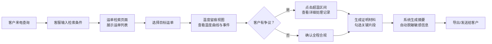

## 1. 产品概述

冷链客服 Web 工作台是面向三方物流客服人员的专业工具，用于高效处理客户关于运单温度的查询与争议。通过整合运单检索、温度留痕可视化和证明材料生成三大核心功能，帮助客服在电话沟通时快速说清货物是否全程合规、异常发生在哪里、企业当时如何处置，大幅提升客户沟通效率和满意度。

## 2. 核心特性

### 2.1 用户角色
| 角色 | 登录方式 | 核心权限 |
|------|----------|----------|
| 客服人员 | 企业账号登录 | 运单检索、温度查看、证明生成、数据导出 |

### 2.2 功能模块
1. **运单检索页面**：多条件检索、运单列表、运单概览卡片
2. **温度留痕视图页面**：温度曲线图、时间轴事件、超温区间详情、异常处理记录
3. **证明材料生成页面**：片段勾选、摘要生成、敏感信息脱敏、一键导出

### 2.3 页面详情
| 页面名称 | 模块名称 | 功能描述 |
|-----------|-------------|---------------------|
| 运单检索 | 搜索栏 | 支持运单号、客户名称、发货日期多维度组合查询 |
| 运单检索 | 运单列表 | 展示运输线路、货品类型、要求温区、当前状态，支持快速跳转 |
| 运单检索 | 运单概览 | 选中运单后展示关键指标和合规概览 |
| 温度留痕视图 | 温度曲线图 | 带温区参考线的连续温度曲线，高亮超温区间 |
| 温度留痕视图 | 时间轴 | 统一时间轴展示开关门节点、报警记录、人工备注 |
| 温度留痕视图 | 异常详情 | 点击超温区间展示持续时长、最高温度、车辆位置、处理动作 |
| 证明材料生成 | 片段选择 | 勾选需要展示的时间片段和事件类型 |
| 证明材料生成 | 摘要预览 | 实时预览生成的温度留痕摘要 |
| 证明材料生成 | 导出功能 | 生成 PDF 或打印，自动脱敏司机手机号等内部信息 |

## 3. 核心流程

## 4. 用户界面设计

### 4.1 设计风格
- **主色调**：冷蓝色系（#0EA5E9 主色、#0284C7 深色），传达专业、可信赖、冷链的行业特性
- **辅助色**：警示红（#EF4444）用于超温告警，成功绿（#10B981）用于合规状态，警告橙（#F59E0B）用于注意事项
- **中性色**：深灰（#1E293B）背景、中灰（#64748B）文字、浅灰（#F1F5F9）卡片背景
- **按钮风格**：圆角 8px，高度 40px，悬停有轻微阴影和背景色变化
- **字体**：使用 Inter 字体家族，标题 600 粗体，正文 400 常规，数据展示使用等宽字体
- **布局风格**：顶部导航 + 侧边面包屑 + 主内容区三栏布局，卡片式信息组织，充足留白
- **图标风格**：使用 Lucide 线性图标，保持 20px 统一尺寸，与文字间距 8px

### 4.2 页面设计概述
| 页面名称 | 模块名称 | UI 元素 |
|-----------|-------------|-------------|
| 运单检索 | 搜索栏 | 三列搜索表单、圆角输入框、带图标的搜索按钮、重置按钮 |
| 运单检索 | 运单列表 | 斑马纹表格、状态标签（颜色区分）、操作按钮悬停效果、分页器 |
| 运单检索 | 概览卡片 | 四格指标卡（总时长、合规率、报警次数、当前状态）、渐变背景 |
| 温度留痕视图 | 温度曲线 | SVG 绘制的平滑曲线、温区参考虚线、超温区域红色半透明填充 |
| 温度留痕视图 | 时间轴 | 垂直时间轴、不同类型事件使用不同颜色圆点、时间标注、可交互 |
| 温度留痕视图 | 详情面板 | 右侧滑出面板、关键指标大字展示、地图位置示意、处理记录列表 |
| 证明材料生成 | 片段选择 | 复选框列表、时间范围选择器、事件类型筛选标签 |
| 证明材料生成 | 摘要预览 | 仿 A4 纸张效果、公司抬头、温度曲线缩略图、脱敏文字效果 |
| 证明材料生成 | 操作区 | 固定底部操作栏、主按钮突出、导出格式选择 |

### 4.3 响应式
- 桌面优先设计，最小支持 1280px 宽度
- 主要操作区域固定宽度，内容区域自适应
- 表格支持横向滚动，温度曲线支持缩放

### 4.4 动效设计
- 页面加载：元素依次淡入，间隔 100ms
- 卡片悬停：轻微上浮（translateY(-2px)）+ 阴影加深
- 按钮点击：scale(0.98) 反馈
- 温度曲线：绘制时从左到右描边动画
- 详情面板：从右侧滑入，300ms ease-out
- 状态标签：脉冲动画提示异常状态
