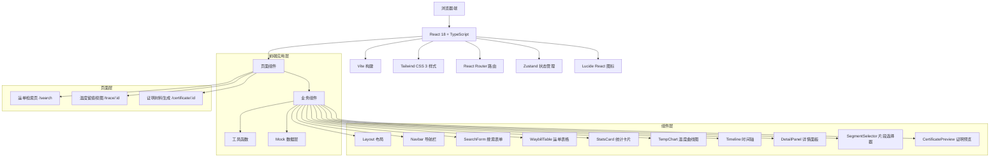
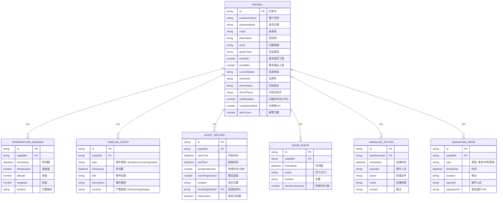

## 1. 架构设计



## 2. 技术描述

- **前端框架**：React@18.2.0 + TypeScript@5.0.0
- **构建工具**：Vite@5.0.0
- **样式方案**：Tailwind CSS@3.4.0
- **路由管理**：React Router DOM@6.20.0
- **状态管理**：Zustand@4.4.0
- **图表方案**：使用原生 SVG 绘制温度曲线（无需第三方图表库）
- **图标库**：Lucide React@0.294.0
- **后端**：无需真实后端，使用 Mock 数据模拟
- **数据库**：使用 TypeScript 定义的数据模型 + JSON Mock 数据

## 3. 路由定义

| 路由 | 页面 | 说明 |
|-------|---------|------|
| / | 重定向到 /search | 默认首页 |
| /search | 运单检索页 | 多条件搜索运单，展示运单列表 |
| /trace/:id | 温度留痕视图 | 展示指定运单的温度曲线和时间轴 |
| /certificate/:id | 证明材料生成 | 勾选片段并生成温度留痕摘要 |

## 4. 数据模型

### 4.1 数据模型定义



### 4.2 TypeScript 类型定义

```typescript
// 运单基础信息
interface Waybill {
  id: string;
  customerName: string;
  shipmentDate: string;
  origin: string;
  destination: string;
  route: string;
  goodsType: string;
  tempMin: number;
  tempMax: number;
  currentStatus: 'in_transit' | 'delivered' | 'exception';
  vehicleNo: string;
  driverName: string;
  driverPhone: string;
  totalDuration: number;
  complianceRate: number;
  alertCount: number;
}

// 温度读数
interface TemperatureReading {
  id: string;
  waybillId: string;
  timestamp: string;
  temperature: number;
  latitude: number;
  longitude: number;
  location: string;
}

// 时间轴事件
type EventType = 'alert' | 'door_open' | 'door_close' | 'remark' | 'signature';
type EventSeverity = 'info' | 'warning' | 'danger';

interface TimelineEvent {
  id: string;
  waybillId: string;
  type: EventType;
  timestamp: string;
  title: string;
  description: string;
  severity: EventSeverity;
}

// 报警记录
interface AlertRecord {
  id: string;
  waybillId: string;
  startTime: string;
  endTime: string;
  durationMinutes: number;
  maxTemperature: number;
  location: string;
  handlingActionId: string;
  isResolved: boolean;
}

// 处理动作
interface HandlingAction {
  id: string;
  alertRecordId: string;
  timestamp: string;
  operator: string;
  action: string;
  result: string;
  remark: string;
}

// 签收节点
interface SignatureNode {
  id: string;
  waybillId: string;
  type: 'departure' | 'transit' | 'delivery';
  timestamp: string;
  location: string;
  operator: string;
  signatureUrl: string;
}

// 证明材料片段选择
interface CertificateSegment {
  id: string;
  startTime: string;
  endTime: string;
  type: 'temperature' | 'alert' | 'door' | 'signature';
  selected: boolean;
  title: string;
}

// 应用状态
interface AppState {
  waybills: Waybill[];
  selectedWaybill: Waybill | null;
  temperatureReadings: TemperatureReading[];
  timelineEvents: TimelineEvent[];
  alertRecords: AlertRecord[];
  handlingActions: HandlingAction[];
  signatureNodes: SignatureNode[];
  selectedAlertId: string | null;
  certificateSegments: CertificateSegment[];
  searchFilters: {
    waybillId: string;
    customerName: string;
    shipmentDate: string;
  };
}
```

## 5. 目录结构

```
src/
├── components/           # 通用组件
│   ├── Layout.tsx        # 页面布局
│   ├── Navbar.tsx        # 导航栏
│   ├── SearchForm.tsx    # 搜索表单
│   ├── WaybillTable.tsx  # 运单表格
│   ├── StatsCard.tsx     # 统计卡片
│   ├── TempChart.tsx     # 温度曲线图
│   ├── Timeline.tsx      # 时间轴组件
│   ├── DetailPanel.tsx   # 详情面板
│   ├── SegmentSelector.tsx # 片段选择器
│   └── CertificatePreview.tsx # 证明预览
├── pages/                # 页面组件
│   ├── SearchPage.tsx    # 运单检索页
│   ├── TracePage.tsx     # 温度留痕视图
│   └── CertificatePage.tsx # 证明材料生成
├── store/                # 状态管理
│   └── useAppStore.ts    # Zustand store
├── data/                 # Mock 数据
│   ├── mockWaybills.ts   # 运单数据
│   ├── mockTemperatures.ts # 温度数据
│   ├── mockEvents.ts     # 事件数据
│   └── mockAlerts.ts     # 报警数据
├── types/                # 类型定义
│   └── index.ts          # 所有类型定义
├── utils/                # 工具函数
│   ├── format.ts         # 格式化工具
│   ├── mask.ts           # 脱敏工具
│   └── temperature.ts    # 温度计算工具
├── App.tsx               # 根组件
├── main.tsx              # 入口文件
└── index.css             # 全局样式
```
